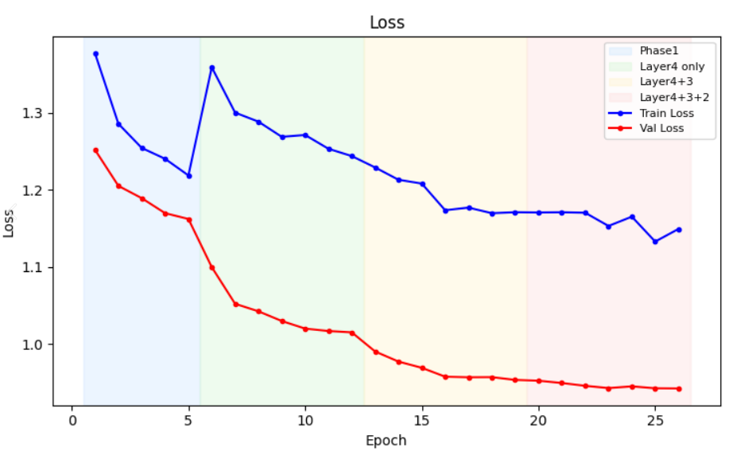
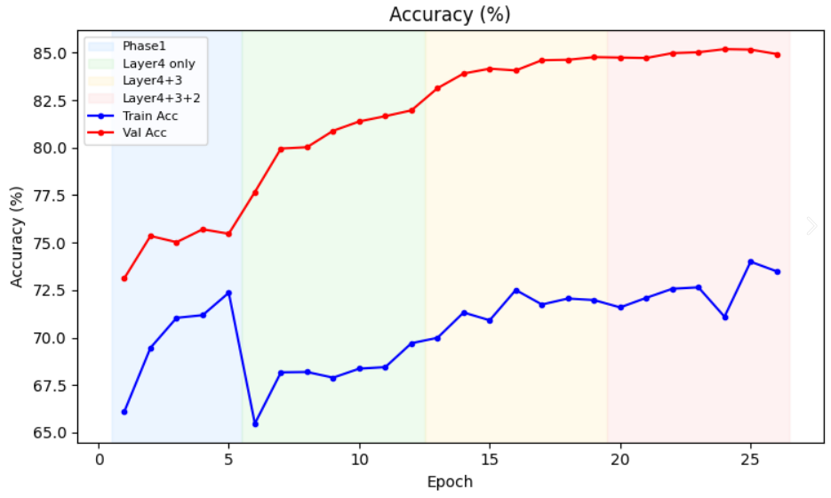
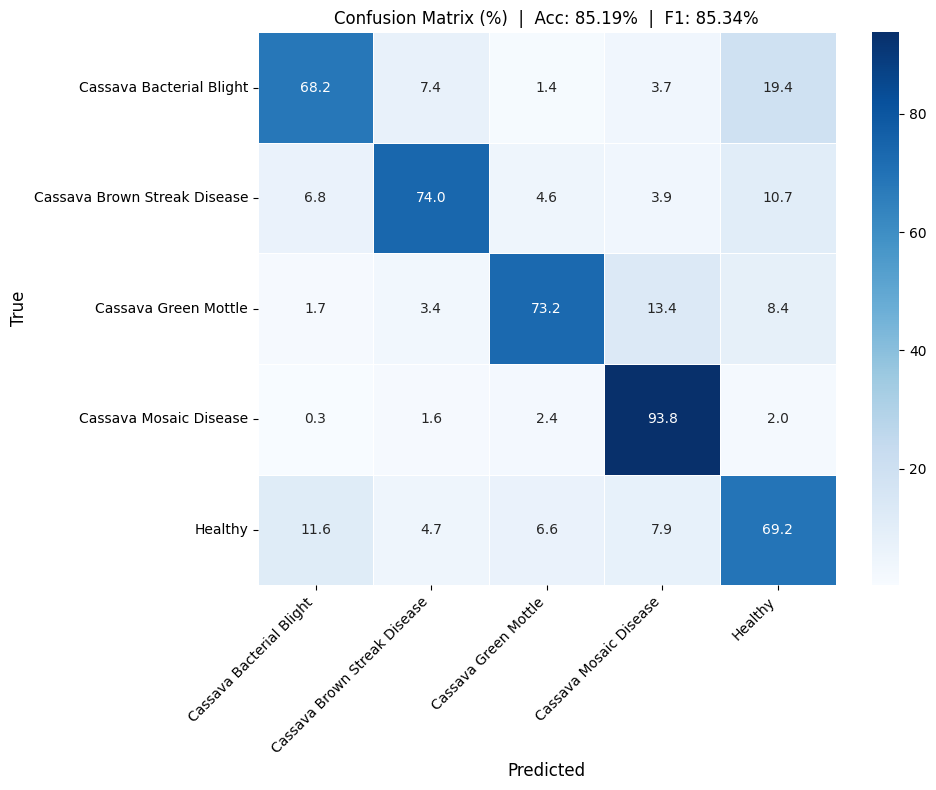

# Cassava Leaf Disease Classification

A deep learning pipeline for classifying cassava leaf diseases from images using transfer learning.

---

## Project Overview

Cassava is a critical food crop in Africa, but it is highly susceptible to viral and bacterial diseases that can devastate harvests. This project trains a convolutional neural network to classify cassava leaf images into five categories:

| Label | Disease |
|-------|---------|
| 0 | Cassava Bacterial Blight (CBB) |
| 1 | Cassava Brown Streak Disease (CBSD) |
| 2 | Cassava Green Mottle (CGM) |
| 3 | Cassava Mosaic Disease (CMD) |
| 4 | Healthy |

The dataset comes from the [Kaggle Cassava Leaf Disease Classification](https://www.kaggle.com/c/cassava-leaf-disease-classification) competition (~21,000 labelled images).

---

## Architecture

### Baseline — ResNet18
- ImageNet pre-trained ResNet18, backbone frozen, only the final classifier head is trained.
- Single linear classifier head (512 → 5).
- Adam (fixed LR = 1e-3), no scheduler.
- Fixed 8 epochs, no early stopping.

### Main Model — ResNet50 + CutMix
- ImageNet pre-trained ResNet50.
- **Phase 1 (5 epochs):** Backbone frozen; only the two-layer classifier head is trained. AdamW + CosineAnnealingLR.
- **Phase 2 (progressive unfreezing):** `layer4 → layer3 → layer2` are unfrozen sequentially, each at a lower learning rate (`5e-5 → 3e-5 → 1e-5`), 7 epochs per stage.
- **CutMix** data augmentation applied in Phase 2 for improved generalisation.
- **Class-weighted cross-entropy** (square-root dampened) + **label smoothing (0.1)** to handle class imbalance.
- **Early stopping** (patience = 5 epochs).
- Gradient clipping (max norm = 1.0).

---

## Results

| Model | Val Accuracy | Val F1 (weighted) |
|-------|--------------|-------------------|
| ResNet18 (baseline) | ~73%         | ~71%              |
| ResNet50 + CutMix   | ~85%         | ~85%              |

### Sample Plots

| Loss Curve | Accuracy Curve | Confusion Matrix |
|------------|---------------|-----------------|
|  |  |  |

---

## Repository Structure

```
cassava-leaf-disease/
├── config.py          # All hyperparameters and paths
├── dataset.py         # CassavaDataset + augmentation pipelines
├── model.py           # ResNet50 and ResNet18 model factories
├── train.py           # ResNet50 training loop (Phase 1 + Phase 2 CutMix)
├── baseline.py        # ResNet18 baseline training
├── predict.py         # Standalone inference script ← start here
├── utils.py           # Metrics + plotting helpers
├── requirements.txt
├── .gitignore
└── plots/             # Auto-generated after training
    ├── resnet50_loss_curve.png
    ├── resnet50_accuracy_curve.png
    ├── resnet50_confusion_matrix.png
    ├── baseline_loss_curve.png
    ├── baseline_accuracy_curve.png
    └── baseline_confusion_matrix.png
```

---

## How to Run

### 1. Install dependencies

```bash
pip install -r requirements.txt
```

### 2. Prepare the dataset

Download the dataset from Kaggle and place it as follows:

```
data/
├── train.csv
└── train_images/
    ├── 1000015157.jpg
    ├── 1000201771.jpg
    └── ...
```

Or update `DATA_DIR`, `TRAIN_IMG_DIR`, and `TRAIN_CSV` in `config.py` to match your local paths.

### 3. Train the baseline

```bash
python baseline.py
```

Saves `baseline_resnet18.pth` and plots to `plots/`.

### 4. Train the main model

```bash
python train.py
```

Saves `best_model.pth` and plots to `plots/`.

### 5. Run inference on a new image

```bash
# Using the main ResNet50 model
python predict.py path/to/leaf.jpg

# Using the baseline
python predict.py path/to/leaf.jpg --model baseline
```

**Example output:**
```
Prediction : Cassava Bacterial Blight
Confidence : 94.2%
```

---

## Key Design Decisions

- **Frozen baseline** trains only the final linear layer, giving a fast lower-bound benchmark with no risk of catastrophic forgetting.
- **Progressive unfreezing** prevents catastrophic forgetting in the main model by letting the backbone adapt gradually at decreasing learning rates.
- **CutMix** (rather than simple Mixup) was chosen because it preserves local disease patterns that are diagnostic.
- **Square-root class weighting** provides softer re-balancing than pure inverse-frequency, which was found to over-correct on the majority class (CMD).
- **Label smoothing (0.1)** reduces overconfident predictions, which is especially helpful for visually similar disease classes.
